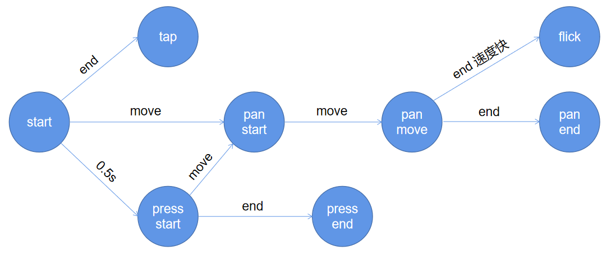

# 第十六周总结

## 组件化——手势组件

PointerEvent、MouseEvent、TouchEvent

### 手势需求

PC 端和移动端兼容。

### 手势分类

- Tap——点击
- Pan——拖拽
- Flick——快速拖拽
- Press——长按

### 实现步骤：

#### 实现监听器

1. 监听鼠标事件：
   - mousedown
   - mousemove
   - mouseup
2. 监听触摸事件：
   - touchstart
   - touchmove
   - touchend
   - touchcancel
3. 抽象鼠标和触摸事件共同的行为：
   - start
   - move
   - end
   - cancel（touch）

#### 识别 4 种手势

如下是 4 种手势的生命周期图：

#### 事件派发

- CustomEvent

- EventTarget.dispatchEvent()

## Carousel 组件集成 Animation 与 Gesture 组件

### 集成 Animation 组件

### 集成 Gesture 组件